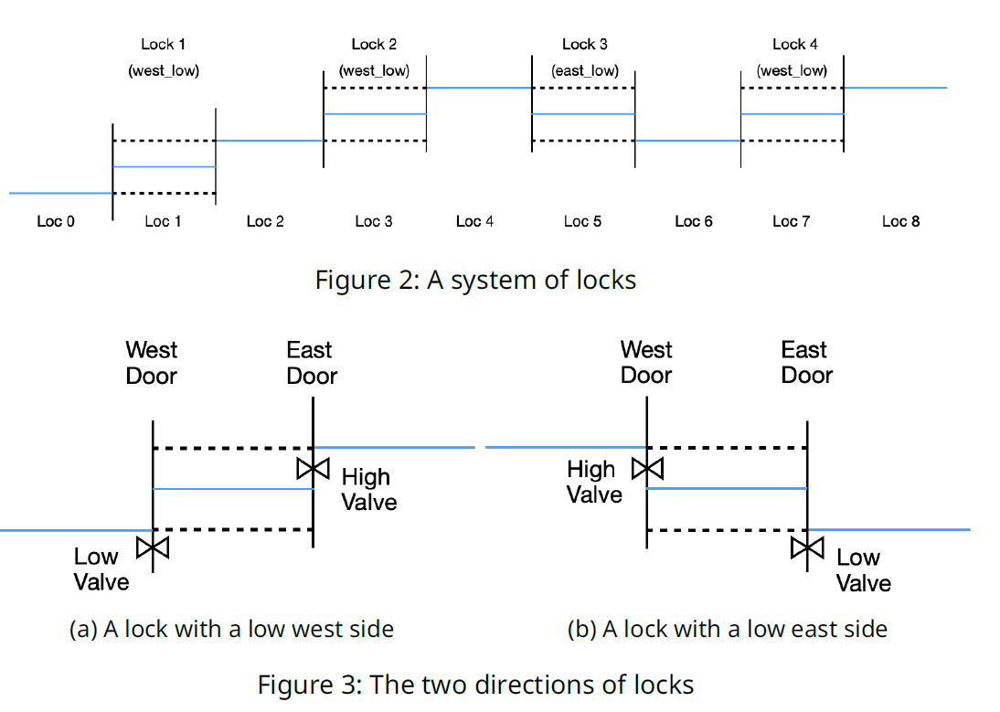

# Software Specification (2IX20)
**2025–2026**
# Assignment 2: Formal specification and verification

The purpose of this assignment is to create a formal model of the Panama canal lock system using the PlusCal language, formally specify requirements, and verify that your model satisfies these requirements using TLA+.

After this assignment, you will be able to model a software system in the PlusCal language and specify requirements as temporal properties. Further, you will be able to use the TLA+ model checker to check whether the model satisfies the given temporal properties.

**Deadline** Tuesday, 21 October 2025, 23:59h

**Submission** The following two files should be uploaded in AnsDelft:
* A single PDF file describing both models and the verification results.
* A ZIP file containing the TLA+ project for the single lock system, and for the multiple lock system.

**Grading information** See Canvas, you can also find the rubric there.

You are to complete this exercise in **teams of 2**, as registered on this course's Canvas page. We use TLA+ in **version 1.7.4** for this assignment.

# 1 Introduction

This second assignment is about creating a formal model of the control software of a lock system, formalising some requirements of this system, and proving that the model satisfies these requirements.

The context is similar to the lock system of the Panama canal from the first assignment, but is restricted to allow for simpler models. The assignment requires you to model and verify two different systems: first, a system that consists of a single lock and a single ship. Second, a model that consists of multiple locks and multiple ships. These two models will be expressed in the PlusCal language. The correctness criteria will be specified as formulas in temporal logic and/or invariants. The TLA+ model checker will be used to formally verify the correctness of the PlusCal models.

Please study the chapter on TLA+ in the reader and the tutorials on learntla.com to get familiar with TLA+ and PlusCal before diving deeper into the assignment.

**Tasks.** This assignment is divided into two tasks:

1. The first step is to model a main control process that correctly controls a single lock for a single ship. You need to verify, using TLA+, that this control process correctly manages the system. See Section 4 for more details.
2. The second step is to generalise the model to account for multiple locks and multiple ships. This generalisation mainly requires an adaptation of the main control process, but the lock and ship process types are also mildly affected. The lock process definition specifies how a lock reacts to commands from the main control process and the ship process definition specifies how ships act and react. See Section 5 for more details.

We indicate specific steps for each task with the symbol $\blacktriangleright$ in the following.

**Note 1.** These tasks may require several iterations. The properties that need to be verified may lead you to modify your model. Make sure that all properties are expressed in the corresponding model. In other words, the properties mentioned in Section 4 must be expressed in the model of the single lock system, and the properties mentioned in Section 5 must be expressed in the model of the multiple locks system.

**Note 2.** This assignment contains the requirements for a particular model of the control software, as opposed to requiring you to use the informal specification you created when you worked on assignment 1. This is to ensure that your success for this assignment does not depend on your result for the previous assignment.

## 1.1 TLA+ project

We provide a TLA+ project to get you started. The project contains a PlusCal model of the environment, so that you can focus on modelling the control software. The project contains the following relevant files:

* `lock_data` contains general data structures used in the model. We describe the data structures in Section 2.
* `lock_system` is the main starting point and configures whether to use the single lock or multiple lock file. One can select which model to use by defining either `EXTENDS lock_single` or `EXTENDS lock_multiple`.
* `lock_single` is the main file for the model with a single lock and single ship. We describe it in detail in Section 4. The corresponding `model_single` is used for the verification.
* `lock_multiple` is an extension of `lock_single` and the main file for the model with multiple locks and multiple ships. We describe it in detail in Section 5. The corresponding `model_multiple` is used for the verification.

# 2 Data structures

The file `lock_data` defines general constants, data structures and helper functions which are used for both lock models. The PlusCal code is given in Figure 1.

## Constants

Lines 8 to 12 specify constants which need to be set for the model. These constants specify the number of locks and ships to use, and the maximal number of ships per location and maximal number of ships within a lock. The assumptions in Lines 13 to 16 ensure that reasonable values are used for these constants. The number of ships and locks are either both 1 for `model_single` or larger than 1 for `model_multiple`. We allow 2 ships per location and only a single ship per lock.

## Data structures

Lines 23 to 39 introduce data structures which are used in the models. `Locks` and `Ships` enumerate the locks and ships, respectively.

**Note 3.** TLA+ requires unique ids for processes. Thus, we first enumerate the lock ids and then enumerate the ship ids afterwards. For example, in the model with a single lock and ship, the lock has id 1 and the ship has id 2.

In our setting, we do not consider flights of more than one lock. That means there is always space between two locks. An example system of locks is depicted in Figure 2. The ship locations are enumerated from 0 to `NumLocks`$\times 2$. Even locations correspond to ship locations outside a lock, odd locations correspond to lock chambers, such that the odd location $i$ corresponds to the chamber of lock $(i+1)/2$. Locks can be oriented such that either the west side corresponds to the low water level ("west\_low") or the east side ("east\_low"). The data types `LockSide` and `ValveSide` are used to refer to a specific set of doors and valves, respectively. We depict both lock orientations and corresponding components

```tla
1  MODULE lock_data
2  
3  EXTENDS Integers, Sequences, FiniteSets, TLC
4  
5  \*****************************
6  \* Define constants
7  \*****************************
8  CONSTANTS
9    NumLocks,
10   NumShips,
11   MaxShipsLocation,
12   MaxShipsLock
13 ASSUME NumLocks \in Nat /\ NumLocks >= 1
14     /\ NumShips \in Nat /\ NumShips >= 1
15     /\ MaxShipsLocation \in Nat /\ MaxShipsLocation >= 1
16     /\ MaxShipsLock \in Nat /\ MaxShipsLock >= 1 /\ MaxShipsLock <= MaxShipsLocation
17     
18  \*****************************
19  \* Define data structures
20  \*****************************
21  
22  \* Locks
23  Locks == 1..NumLocks
24  \* Ships have higher ids than locks
25  \* This is needed to avoid overlap with the lock process ids
26  Ships == (NumLocks+1).. (NumLocks+NumShips)
27  \* Even locations are outside lock
28  \* Odd locations are inside lock: location i corresponds to lock (i+1)/2
29  Locations == 0..NumLocks*2
30  
31  \* Data types
32  LockOrientation == {"west_low", "east_low"}
33  LockSide == {"west", "east"}
34  ValveSide == {"low", "high"}
35  WaterLevel == {"low", "high"}
36  LockCommand == {"change_door", "change_valve", "finished"}
37  
38  ShipStatus == {"go_to_west", "go_to_east", "goal_reached"}
39  
40  \*****************************
41  \* Helper functions
42  \*****************************
43  
44  \* Get the low/high side from a lock with a given orientation
45  LowSide (lock_orientation) == IF lock_orientation = "west_low" THEN "west" ELSE "east"
46  HighSide (lock_orientation) == IF lock_orientation = "west_low" THEN "east" ELSE "west"
47  
48  \* End points for ship locations
49  WestEnd == 0
50  EastEnd == NumLocks*2
51  
52  \* Get lock corresponding to given location
53  \* Assumes that location is an odd value
54  GetLock(location) == (location + 1) \div 2
55  \* Check if a given location is within a lock.
56  \* Returns true if the location is an odd value
57  IsLock (location) == location % 2 = 1
58  
```

**TLA+ Code 1: Data structures used in the PlusCal model of a lock system.**




**Figure 2: A system of locks; Figure 3: The two directions of locks**


in Figure 3. Data type `WaterLevel` is used to reflect the water level in a lock. Data type `LockCommand` represents the different command which can be sent to a lock to control it. The details will be given in Section 3.4. Data type `ShipStatus` represents the goal of the ship: whether it goes from east to west, from west to east, or whether the goal has been reached. The last status "`goal_reached`" is useful when formulating requirements later on.

## Helper functions

Lastly, Lines 46 to 59 introduce some helper functions which are commonly used in the model. For instance, the function `LowSide` returns the low side for a given lock orientation. The function `GetLock` returns the lock id corresponding to a given (odd) location. The function `IsLock` returns true if the given locations is within a lock.

**Note 4.** You are free to add additional helper functions here. Such functions can be useful to structure the model and can avoid code duplication for operations which occur multiple times.


# 3 Model of the Environment

In order to build full, verifiable models of your controller, a model of the environment containing the locks and ships must be taken into account. To help you focus your modelling effort on the controller, we already provide processes for the locks and ships and their corresponding variables.

For now, we only consider the specification of a single lock and a single ship as given in `lock_single`. We give the relevant code fragment in Figure 4.

## 3.1 Global variables

The global variables in Lines 11 to 29 are used to keep track of the general setup of the system and the current status of the lock and ship. The `lockOrientation` defines the orientation of the lock. Variables `doorsOpen`, `valvesOpen` and `waterLevel` store the current status of the components of the lock. The variables `shipLocation` and `shipStatus` store the location and the current trajectory of the ship.

The last three variables are used for communication between the different processes. Variable `lockCommand` stores the current command which is given to the lock. A command to the lock is either "`change_door`" or "`change_valve`". For command "`change_door`" the additional arguments specify the side "`west`"/ "`east`" where the doors should move, and whether to open/close them. For command "`change_valve`" the additional arguments specify whether to change the "`high`"/ "`low`" valves, and whether to open/close them. If the lock process successfully executed a command, it will respond by setting the `lockCommand` to "`finished`".

Variable `requests` models a central FIFO queue where all requests of ships to enter a lock are gathered. All ships can append new requests to the central queue. The control system processes these requests and removes the corresponding requests from the queue. The answer—the permission whether a ship can enter a lock or not—is returned in the buffer `permissions`. Each ship has its own buffer of permissions.

## 3.2 Type checks

Type checks are a good way to ensure that all variables contain the correct type of data. We added type checks for the variables and message queues in Lines 44 to 63.

## 3.3 Helper function

Additional helper functions are given in Line 37. More functions can be added if necessary. We also define helper macros in ??–??, see Figure 5. Macro `updateWaterLevel` is used by the lock process to set the current water level according to the status of valves and doors. The general macros `read` and `write` can be used to read


```tla
1  MODULE lock_single
2  
3  EXTENDS lock_data
4  
5  (*--algorithm lock_system
6  
7  \*****************************
8  \* Define global variables
9  \*****************************
10 variables
11   \* Variables for locks
12   lockOrientation = "west_low",
13   doorsOpen = [ls \in LockSide |-> FALSE],
14   valvesOpen = [vs \in ValveSide |-> FALSE],
15   waterLevel = "low",
16  
17   \* Variables for single ship
18   shipLocation = 0,
19   shipStatus = "go_to_east",
20  
21   \* Command for lock
22   \* for command "change_door" the side should be "west" or "east"
23   \* for command "change_valve" the side should be "high" or "low"
24   lockCommand = [command |-> "finished", open |-> FALSE, side |-> "west"],
25  
26   \* Central requests of all ships
27   requests = << >>,
28  
29   \* Permissions per ship
30   permissions = << >>;
31  
32  define
33  \*****************************
34  \* Helper functions
35  \*****************************
36  \* Check if ship is within the lock
37  InLock == IsLock(shipLocation)
38  
39  \*****************************
40  \* Type checks
41  \*****************************
42  \* Check that variables use the correct type
43  TypeOK == /\ lockOrientation \in LockOrientation
44            /\ \A ls \in LockSide: doorsOpen[ls] \in BOOLEAN
45            /\ \A vs \in ValveSide: valvesOpen[vs] \in BOOLEAN
46            /\ waterLevel \in WaterLevel
47            /\ lockCommand.command \in LockCommand
48            /\ lockCommand.open \in BOOLEAN
49            /\ lockCommand.side \in LockSide \union ValveSide
50            /\ shipLocation \in Locations
51            /\ shipStatus \in ShipStatus
52            /\ \A i \in 1..Len(permissions):
53               /\ permissions[i].lock \in Locks
54               /\ permissions[i].granted \in BOOLEAN
55            /\ \A i \in 1..Len(requests):
56               /\ requests[i].ship \in Ships
57               /\ requests[i].lock \in Locks
58               /\ requests[i].side \in LockSide
59  
60  \* Check that message queues are not overflowing
61  MessagesOK == /\ Len(requests) <= 1
62            /\ Len(permissions) <= 1
63  
```

**TLA+ Code 4: PlusCal definitions used by single lock.**

```tla
9  \* Update the water level according to the state of doors and valves
10 macro updateWaterLevel (lock_orientation, doors, valves, waterlevel) begin
11   if valves["low"] then
12     \* Water can flow out through valve
13     waterlevel := "low";
14   elsif (lock_orientation = "west_low" /\ doors["west"])
15        \/ (lock_orientation = "east_low" /\ doors["east"]) then
16     \* Water can flow out through lower door
17     waterlevel := "low";
18   elsif valves["high"] then
19     \* Water can flow in through valve
20     waterlevel := "high";
21   elsif (lock_orientation = "west_low" /\ doors["east"])
22        \/ (lock_orientation = "east_low" /\ doors["west"]) then
23     \* Water can flow in through higher door
24     waterlevel := "high";
25   \* In other case, the water level stays the same
26   end if;
27 end macro
28  
29  \* Read res from queue.
30  \* The macro awaits a non-empty queue.
31  macro read (queue, res) begin
32    await queue /= <<>>;
33    res := Head (queue);
34    queue := Tail (queue);
35  end macro
36  
37  \* Write msg to the queue.
38  macro write (queue, msg) begin
39    queue := Append (queue, msg);
40  end macro
```

**TLA+ Code 5: Helper macros.**

```tla
128 process lockProcess \in Locks
129 begin
130   LockWaitForCommand:
131   while TRUE do
132     await lockCommand.command /= "finished";
133     if lockCommand.command = "change_door" then
134       \* Change status of door
135       doorsOpen[lockCommand.side] := lockCommand.open;
136     elsif lockCommand.command = "change_valve" then
137       \* Change status of valve
138       valvesOpen[lockCommand.side] := lockCommand.open;
139     else
140       \* should not happen
141       assert FALSE;
142     end if;
143     LockUpdateWaterLevel:
144     updateWaterLevel(lockOrientation, doorsOpen, valvesOpen, waterLevel);
145     LockCommandFinished:
146     lockCommand.command := "finished";
147   end while;
148 end process;
```

**TLA+ Code 6: PlusCal process for a lock.**

the top message from a queue and write a message to the back of a queue, respectively.

**Note 5.** The `read` macro awaits a non-empty queue. So the function `read` blocks if the queue is empty until a message arrives.

## 3.4 The Lock Process Type

The lock process operates the lock components such as doors and valves. The lock process makes use of the variables defined in Figure 4. The `lockOrientation` determines at which side the lower water level is located. The status of each pair of doors is stored in `doorsOpen`. For instance, `doorsOpen["west"]` returns true if the doors on the west side are open and false if they are closed. Similarly, variable `valvesOpen` stores the status of the valves. Opening the "`high`" valve increases the water level, opening the "`low`" valve decreases the water level. Details how the water level is changed are specified in the `updateWaterLevel` macro in Figure 5.

The lock process is given in Figure 6. The process consists of a loop (Lines 131 to 147) which runs forever. First, the process waits for a new command (Line 132). As long as `lockCommand.command` has the value "`finished`", the process is blocked and waits for a new command. If a new command arrives—and the `lockCommand.command` changes its value—the behaviour depends on the type of the command. Command "`change_door`" changes the status of the doors on the given side of the lock (Lines 133 to 135), command "`change_valve`" changes the status of the valves (Lines 136 to 138). After handling a command, the water level is updated (Line 144) and the `lockCommand.command` is set to "`finished`"


to signal that the command was successfully executed.

The process uses the label `LockWaitForCommand` to indicate that the process is waiting for a command. Label `LockUpdateWaterLevel` indicates that the water level will be updated. Label `LockCommandFinished` indicates that a command was received and successfully executed. The part between the labels is executed as one atomic part.

**Note 6.** To keep the system model relatively simple, we do not consider the water level changing outside of the lock. We assume that the higher side of a lock has a virtually infinite supply of water and the lower side can drain a virtually infinite amount of water. Thus, opening the doors on either side of the lock has practically no effect on the water level outside of the lock and we assume the water level outside a lock never changes. Moreover, the lock doors should only be opened if the water levels inside and outside the lock chamber are equal anyway. To lower the water level inside a lock, its lower valve should be opened, and to raise the water level inside a lock, its higher valve should be opened.

**Note 7.** When an instance of the lock process is created, this instance is given an ID, which is referred to as `lockProcess`, see Line 128 in Figure 6. Note that this ID is not yet used, but it will be needed when the system is extended to multiple locks, see Section 5.

## 3.5 The Ship Process Type

The ship process moves the ship and makes request to traverse locks. The ship process makes use of the global variables defined in Figure 4. The current ship location is stored in variable `shipLocation` and follows the enumeration of the locations as depicted in Figure 2. The `shipStatus` determines in which direction the ship is currently travelling: "`go_to_west`" or "`go_to_east`", or whether the end was reached "`goal_reached`".

The ship process is given in Figure 7. The process makes use of a local variable `perm` (Line 156) which stores the current permission to enter the lock and is the answer to a ship's request. Similar, to the lock process, the ship process runs in an infinite loop (Lines 159 to 224). Depending on the current travel direction, the ship either travels east (Lines 160 to 188), travels west (Lines 189 to 217) or has reached its goal (Lines 218 to 223).

We consider the case were the ship travels east (Line 160). The case traveling west is similar. First, if the ship has reached the east end, the goal is reached (Lines 161 to 163). Otherwise, the ship needs to travel one location east next. If the ship is currently not in a lock (Line 165), it must be west of the next lock. The ship therefore requests the western doors of the next lock. The request is performed by writing a request message to the `requests` queue (Line 168). The request message contains the id of the requesting ship, the id of the requested lock and the side of the doors which should open. We use the variable `self` to refer to the id of the process. After sending the request, the ships waits for an


```tla
154 process shipProcess \in Ships
155 variables
156   perm = [lock |-> 1, granted |-> FALSE]
157 begin
158   ShipNextIteration:
159   while TRUE do
160     if shipStatus = "go_to_east" then
161       if shipLocation = EastEnd then
162         ShipGoalReachedEast:
163         shipStatus := "goal_reached";
164       else
165         if ~InLock then
166           ShipRequestWest:
167           \* Request west doors of lock
168           write(requests, [ship |-> self, lock |-> 1, side |-> "west"]);
169           ShipWaitForWest:
170           \* Wait for permission
171           read(permissions, perm);
172           assert perm.lock = GetLock(shipLocation+1);
173         else
174           ShipRequestEastInLock:
175           \* Request east doors of lock
176           write(requests, [ship |-> self, lock |-> 1, side |-> "east"]);
177           ShipWaitForEastInLock:
178           \* Wait for permission
179           read(permissions, perm);
180           assert perm.lock = GetLock(shipLocation);
181         end if;
182         ShipMoveEast:
183         if perm.granted then
184           \* Move ship
185           assert doorsOpen[IF InLock THEN "east" ELSE "west"];
186           shipLocation := shipLocation + 1;
187         end if;
188       end if;
189     elsif shipStatus = "go_to_west" then
190       if shipLocation = WestEnd then
191         ShipGoalReachedWest:
192         shipStatus := "goal_reached";
193       else
194         if ~InLock then
195           ShipRequestEast:
196           \* Request east doors of lock
197           write(requests, [ship |-> self, lock |-> 1, side |-> "east"]);
198           ShipWaitForEast:
199           \* Wait for permission
200           read(permissions, perm);
201           assert perm.lock = GetLock(shipLocation-1);
202         else
203           ShipRequestWestInLock:
204           \* Request west doors of lock
205           write(requests, [ship |-> self, lock |-> 1, side |-> "west"]);
206           ShipWaitForWestInLock:
207           \* Wait for permission
208           read(permissions, perm);
209           assert perm.lock = GetLock(shipLocation);
210         end if;
211         ShipMoveWest:
212         if perm.granted then
213           \* Move ship
214           assert doorsOpen[IF InLock THEN "west" ELSE "east"];
215           shipLocation := shipLocation - 1;
216         end if;
217       end if;
218     else
219       assert shipStatus = "goal_reached";
220       ShipTurnAround:
221       \* Turn around
222       shipStatus := IF shipLocation = WestEnd THEN "go_to_east" ELSE "go_to_west";
223     end if;
224   end while;
225 end process;
```

**TLA+ Code 7: PlusCal process for a ship.**

answer. An answer to the request is posted as a message to the `permissions` queue and the ship tries to read from this queue (Line 171). The ship process blocks until a new permission message is added to the `permissions` queue. This message is then stored in the local variable `perm`. The message contains the lock id and whether the request was granted or not.

**Note 8.** There is a label between the sending of the message and the waiting for the message. That way, the sequence is handled as two separate steps instead of one atomic step and other processes can execute in-between.

If the ship is currently in a lock (Line 173), it requests the eastern doors of the current lock (Line 176) and then waits for a permission message, similar to the interaction when the ship is outside a lock.

If the permission was granted to the ship, it moves into the lock (Line 186). If the permission was not granted—for example because the lock is currently not free—then the ship will simply continue with the next iteration of the loop and send a new request. Ships are therefore sending new requests until the request is finally granted.

If the ship has reached its goal, it turns around and travels back in the opposite direction (Line 222). This behavior allows us to model an endless movement of ships without having to introduce a large number of ships.

The ship process uses several labels to split the behaviour into smaller parts which are executed as atomic statements.

**Note 9.** A ship can only request one set of doors at a time: either the western or the eastern doors of a lock. If a ship wants to traverse a lock from west to east, it needs to issue two requests: first request the western doors of the lock, wait for permission, move into the lock (if permission is granted) and then request the eastern doors, wait for permission again and then move out of the lock.

**Note 10.** The ship process does not check whether other ships are already occupying a location. The control process should take care of this and only grant requests if the next location for a ship is not yet full.

# 4 A Single Lock System

## 4.1 Modelling

The first modelling step consists of modelling the main control of a system with a single lock and a single ship. This controller needs to be able to receive requests from ships and control the lock to handle the requests, in other words, to open and close its doors in a safe way.

For the main control, a dummy process type `controlProcess` is already given in the provided template `lock_single`, see Figure 8.

$\blacktriangleright$ Replace the dummy process by a fully functioning main control process. The complete process should receive ship requests via the `requests` message queue and handle them appropriately. Afterwards, the permission to move a


```tla
231 process controlProcess = 0
232 begin
233   ControlStart:
234   \* Implement behaviour
235   skip;
236  
237 end process;
```

**TLA+ Code 8: Dummy PlusCal code for the main control process.**

ship should be either granted or declined via the `permissions` message queue. Before granting permission the lock should be prepared for a ship movement by changing the water level and doors. The status of doors, valves and the water level can be checked via the corresponding global variables `doorsOpen`, `valvesOpen` and `waterLevel`, respectively. The lock can be controlled by sending commands to the lock process via the `lockCommand` variable.

**Note 11.** Make sure that the control process ensures the safety of the lock and the ship. For example, there should only be one ship in the lock at a time and the ship should only move if the corresponding doors are open. We formalize some of these requirements in Section 4.2.

## 4.2 Property Verification

Besides the modelling, you need to formalise system requirements in the form of temporal properties. These properties cover both safety and liveness properties. We already provide dummy properties in `lock_single` (lines 69–82) which should be revised to the correct properties.

**Properties of interest** In the following, we describe each property which should be formalized and then verified.

**Deadlock** No deadlock can be reached.

**DoorsMutex** The eastern pair of doors and the western pair of doors are never simultaneously open.

**DoorsOpenValvesClosed** When the lower pair of doors is open, the higher valve is closed. Similarly, when the higher pair of doors is open, the lower valve is closed.

**DoorsOpenWaterlevelRight** The lower pair of doors is only open when the water level in the lock is low. Similarly, the higher pair of doors is only open when the water level in the lock is high.

**RequestLockFulfilled** Always if the ship requests to enter the lock, the ship will eventually be inside the lock.

**WaterLevelChange** The water level is infinitely many times high and infinitely many times low.

**RequestsShip** Infinitely many times the ship does requests.

**ShipsReachGoals** Infinitely many times the ship reaches the east and the west end.

$\blacktriangleright$ Check that the model is deadlock-free. TLA+ can automatically check for the presence of deadlocks in the model. The property does not need to be formalized but is already present as `Deadlock` in `model_single`. The model that you submit should be deadlock-free.

$\blacktriangleright$ Provide formalisations of the properties of interest (except Deadlock) in your report, and motivate your choices, i.e. why you have phrased the properties this way. Make sure that your model works for both lock orientations ("west\_low" and "east\_low"). In particular the properties mentioning lower/higher doors should work for both lock orientations.

$\blacktriangleright$ For each property (except Deadlock), state whether it is a safety or a liveness property. Briefly justify your answer.

**Note 12.** In the properties, you can only refer to the values of global variables. It is not possible to directly refer to execution steps taken by the PlusCal processes. If you feel the need to, you may add variables to the model to keep track of information you wish to refer to in the properties.

**Verification** Once the properties have been formalised, they can be verified using the TLA+ model checker. Add each property to either `Invariants` or `Properties` in `model_single` depending on their type (safety or liveness property).

$\blacktriangleright$ Describe in your report the outcome of verifying each property: do the above properties hold in your single lock model?

In the final version of your single lock model, all properties should hold, and the formulas to check this should be present in the model. It is allowed that a property only holds under weak or strong fairness.

$\blacktriangleright$ In your report, specify which properties only hold under weak fairness and which only under strong fairness. For these properties, justify why weak/strong fairness is needed and why default behavior is not sufficient.

**Note 13.** If you cannot make the property hold in your model, you may also give an explanation why the property cannot be satisfied.

$\blacktriangleright$ In your report, also provide the state space size of your model and the time it took to perform all checks.


# 5 A Multiple Locks System

## 5.1 Modelling

The next step in the modelling task is to generalise the lock system by allowing the presence of multiple locks with different orientations and multiple ships. The introduction of multiple locks and ships has a number of consequences for the model:

* As each lock has its own orientation, pairs of doors, pairs of valves, and water level, not only the right number of processes must be instantiated, given the number of locks, but also a sufficient number of global variables or arrays must be instantiated to store the states of the locks. Communication to a specific lock is now governed to lock commands specific to this lock.
* Similarly, a set of ships is now used, each with its own location and status. Multiple ships can request locks doors to open. These requests are still centrally handled in one `requests` queue which is handled in a FIFO manner. Each ship has its own `permissions` message queue to grant or decline permission to a specific ship.
* The lock and ship processes are adapted to these new global variables and message queues.

We provide some of these adaptions in the file `lock_multiple`.

$\blacktriangleright$ Your task is to adapt the `controlProcess` in `lock_multiple` such that it can handle all requests of ships and control all the locks in the system. In particular, the control process should handle locks in arbitrary orientations, and environments with arbitrary capacity limits for ships per location (`MaxShipsLocation`) and ships per lock (`MaxShipsLock`).

Your control process should allow for some parallel handling of ships. After handling the request of one ship (and granting or declining the permission), other requests (from different ships) can be handled. In particular, if a ship wants to traverse a lock, this is not necessarily performed in one go. When the request to enter the lock is granted, the control process should be able to handle requests of other ships in-between, before handling the ship's request to leave the lock again.

**Indicate ship movements** Compared to the single ship model, the multiple ship model contains a new global variable `moved`. This variable is used in the ship process to indicate when a ship movement is finished.

$\blacktriangleright$ Is this movement indication required? What happens if the movement indication variable `moved` is not used? Justify your answers in the report.

**Note 14.** The influence of the `moved` variable might become more clear when verifying the properties of interests below.

## 5.2 Property Verification

In the following, we assume at most 2 ships can be at the same location outside a lock, and only one ship can be inside a lock at once, i.e., `MaxShipsLocation` <= 2 and `MaxShipsLock` <= 1.

**Increasing number of ships and locks** When increasing the number of locks and ships in the system, you will notice that the verification time of TLA+ can rapidly increase. This phenomenon is known as the *state space explosion problem*.

$\blacktriangleright$ Try to make the model verifiable, i.e., model checking should finish within at most 5 minutes, for the configurations with 3 locks (Locks 0–2 in Figure 2) and 2 ships, and for 4 locks (all locks in Figure 2) and 2 ships. For these configurations, the multiple locks system should be free of deadlocks. The complexity of the main control process has considerable impact on the verification time. In your report, discuss the time needed to verify the absence of deadlocks of your model with the two configurations and if relevant, which modifications you made to improve the scalability of the model.

**Properties of interest** Similar to the single lock model, the following properties need to be formalised, to check the correctness of the multiple locks system:

**Deadlock** No deadlock can be reached.

**DoorsMutex** For each lock, the eastern pair of doors and the western pair of doors are never simultaneously open.

**DoorsOpenValvesClosed** For each lock: when the lower pair of doors is open, the higher valve is closed. Similarly, when the higher pair of doors is open, the lower valve is closed.

**DoorsOpenWaterlevelRight** For each lock: the lower pair of doors is only open when the water level in the lock is low. Similarly, the higher pair of doors is only open when the water level in the lock is high.

**RequestLockFulfilled** Always if a ship requests to enter a lock, the ship will eventually be inside the lock.

**WaterLevelChange** The water level in each lock is infinitely many times high and infinitely many times low.

**RequestsShip** Infinitely many times each ship does requests.

**ShipsReachGoals** Infinitely many times each ship reaches the east and the west end.

**MaxShipsPerLocation** The maximal ship capacity per location is not exceeded.

$\blacktriangleright$ Check that the model is deadlock-free for the configurations with 3 locks and 2 ships, and for the configuration with 4 locks and 2 ships. As for the single model, the property is already present as `Deadlock` in `model_multiple`. The model that you submit should be deadlock-free for the two configurations.

$\blacktriangleright$ Provide formalisations of the properties of interest (except Deadlock) in your report, and motivate your choices, i.e., why you have formalized the properties in this way.

**Note 15.** The properties should hold for all locks and all ships. Make sure that not only one specific lock or ship is checked in the properties, but all of them.

**Verification** Once the properties have been formalised, they can be verified using TLA+.

$\blacktriangleright$ Describe in your report the outcome of verifying the above properties for your multiple locks system with the configuration of 3 locks and 2 ships.

* Describe the result (true/false) for each property.
* When a property is false, give a counter-example (trace of the system demonstrating that the property does not hold), and explain the erroneous behaviour of the system. If a property is a liveness property, does it hold under weak or strong fairness?

In the final version of your multiple locks system model, all properties should hold. It is allowed that properties only hold under weak fairness.

**Deadlocks** You may notice that if you further increase the number of locks and ships, TLA+ starts to report that there are deadlocks.

$\blacktriangleright$ What is the minimum number of locks and ships that leads to a deadlock and which initial configuration (lock orientations, starting positions of ships, etc.) is used?

$\blacktriangleright$ Provide a counter-example, as given by TLA+, and explain why this execution leads to a deadlock.

**Bonus question** Finally, the model may contain deadlocks when the number of locks and ships is sufficiently high, but you can actually use TLA+ to construct a *schedule* for the main controller that avoids deadlocks in those cases, and allows all ships to reach their goal. For the minimal configuration with deadlocks that you identified earlier, formalise the property that it is not possible for all ships to reach the status "`goal_reached`". Verify this property, and explain what TLA+ reports. If everything works fine, TLA+ should report a counter-example that demonstrates how deadlocks can be avoided. How long is the counter-example, in steps? (It can be very long!). Reason about why this execution avoids deadlocks. To inspect the counter-example, you can select which details to show using the appropriate options.

# 6 Deliverables

## 6.1 Modelling and Verification

All deliverables for this assignment have to be handed in using Ans. You have to hand in the following two items:

1. A report in which you describe and motivate your modelling choices, give formalisations of the requirements, and discuss the verification outcomes. This report should be a **single PDF file**.
2. A **ZIP file** that contains the TLA+ project with all PlusCal files. In particular, it should contain the PlusCal files for the single and multiple lock system and the formalised properties for each model.

**Note 16.** PDFs in the ZIP file are not allowed, the PDF should be separate. Archives other than ZIP are not allowed.

## 6.2 Reflection

At the end of your report, include a section in which you **reflect** on the assignment. This should consist of the following:

1. Description of difficulties you encountered, or any questions you still have.
2. Brief description of the contributions of both team members.
3. (if applicable) Any groups you discussed your assignment with.
